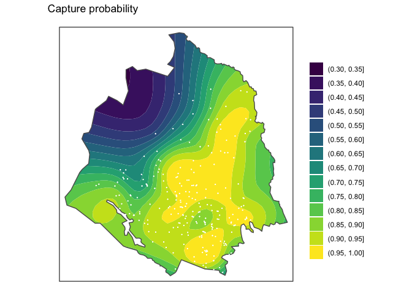
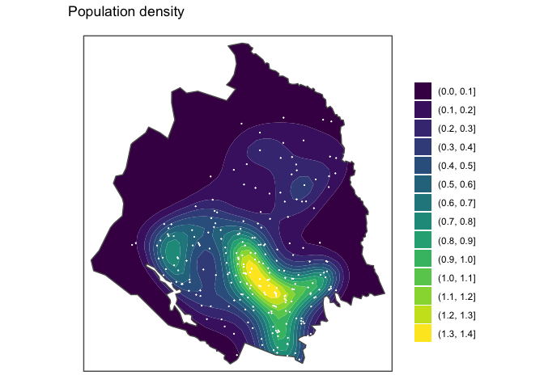
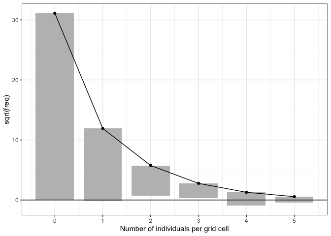
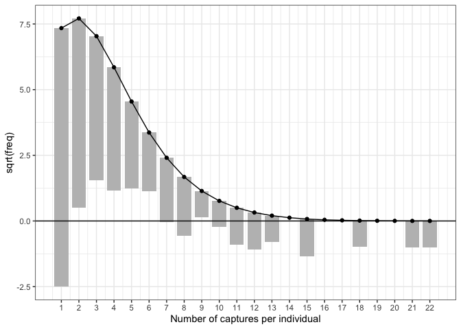

popdensity
================
Martin Sköld

[Bonus material (nationwide maps) for NCWR 2022
conference.](https://htmlpreview.github.io/?https://github.com/mskoldSU/bear_poster/blob/master/all_counties.html)

## Package

This is a simple package for estimating population densities based on
non-invasive genetic sampling of individuals. The problem is motivated
by the Swedish brown bear survey, which is based on scat-samples
collected by volunteers.

Statistical assumptions are

-   Animal locations are characterised by their *activity centers*. For
    animals encountered, these are estimated as the centerpoint of
    samples found.
-   The number of times an individual animal is encountered follows a
    Poisson-distribution, with mean varying as a smooth function of the
    location of the animal’s activity center. This account for
    individual heterogeneity that can be explained by spatial variation
    in sampling effort.
-   Animal activity centers are distributed across the surveyed region
    according to a non-homogenous Poisson-process with a smoothly
    varying intensity in space.

The model takes data in the form of a table where each row represents a
sample, and columns include an individual identifier (`id`) and
geographical coordinates (`east` and `north`) representing Easting and
Northing in a planar coordinate system (SWEREF99 TM in the Swedish
survey). Internally, data is aggregated into two tables - One table with
one row per individual encountered containing the (estimated) activity
center location and number of captures. This is used to estimate the
encounter probability, by fitting a zero-truncated Poisson-distribution
with spatially varying mean using `mgcv::gam` with
`family = countreg::ztpoisson`. - One table with one row per spatial
grid-point (the region is divided by a square grid), containing the
centre coordinate and number of activity centers found in the grid. This
is used to estimate the apparent population density (i.e. density of
activity centers encountered), by by fitting a Poisson-distribution with
spatially varying mean using `mgcv::gam`.

Given the apparent density and encounter probability, an estimate of
population density is found as their ratio.

## Installation

The package depends on `countreg` which is on R-forge (not CRAN), hence
to install `popdensity` run

``` r
install.packages("countreg", repos="http://R-Forge.R-project.org")
devtools::install_github("https://github.com/mskoldSU/popdensity")
```

# Sample session

Data of female scat-samples found during the 2021 survey of Norrbotten
county is included as table `bears2021`

``` r
library(popdensity)
head(bears2021)
```

    ## # A tibble: 6 × 4
    ##   id     date         east   north
    ##   <chr>  <date>      <dbl>   <dbl>
    ## 1 id1827 2021-08-21 696580 7392410
    ## 2 id1827 2021-08-21 697871 7391141
    ## 3 id1758 2021-08-21 710056 7339663
    ## 4 id1709 2021-08-21 739776 7309402
    ## 5 id1868 2021-08-21 698055 7293140
    ## 6 id1868 2021-08-21 698250 7293012

(note that the date field is not a requirement). A polygon defining
Norrbotten is accessed as

``` r
norrbotten <- pd_SWE_counties(county_name = "Norrbotten")
```

and the spatial smooths are fitted by

``` r
fit2021 <- pd_fit(data = bears2021, region = norrbotten)
```

    ## Warning in pd_fit(data = bears2021, region = norrbotten): Data contains 715
    ## records, but only 712 falls within the region.

Three samples did not fall within the polygon, these are excluded from
the model fitting.

We may now plot the encounter probability

``` r
plot(fit2021, type = "p_capture") + ggplot2::ggtitle("Capture probability")
```

<!-- -->

and the population density

``` r
plot(fit2021, type = "pop_density") + ggplot2::ggtitle("Population density")
```

<!-- -->

Here the unit is number of individuals per square 10km (with a meter
based coordinate system).

## Validation

Rootograms are implemented to visually check Poisson and zero-truncated
Poisson assumptions. A rootogram of the gridded counts suggests that the
assumed Poisson model fits well

``` r
pd_rootogram(fit2021, type = "apparent_intensity")
```

<!-- -->

The individual recaptures, however, show clear evidence of
overdispersion with respect to the truncated Poisson

``` r
pd_rootogram(fit2021, type = "effort")
```

<!-- -->

as a consequence, fitted capture probabilities are likely to be
overestimated (and population density underestimated). This suggests
that incorporating (smooth) spatial variability in capture probabilities
is not sufficient to account for individual heterogeneity present in
data.
